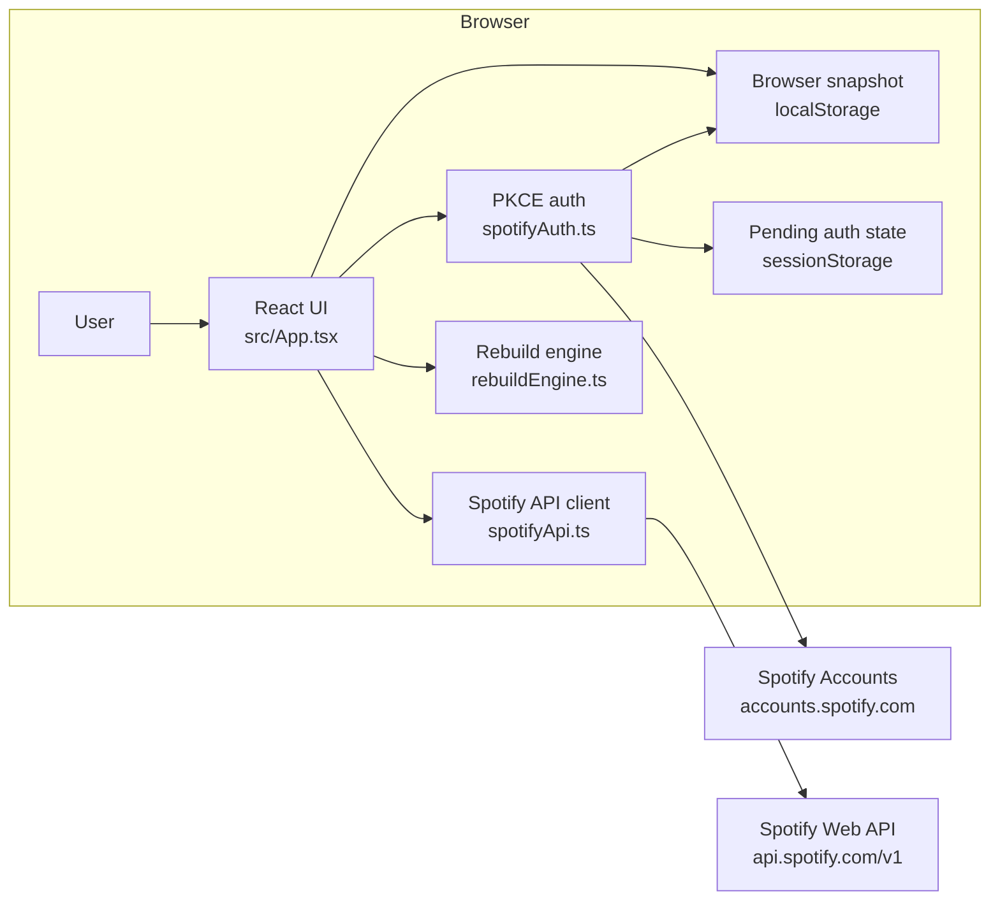

# System Overview

Spotify Playlist Builder Web App is a static React/Vite browser application. It uses Spotify Authorization Code with PKCE, stores playlist-building state in browser storage, calls Spotify APIs directly from the browser, and deploys as static files.

## Goals

- Keep Spotify playlist configuration and rebuild workflows usable from a hosted browser UI.
- Keep the runtime static: no backend service, server-side token storage, database, queue, or worker.
- Keep OAuth client-side with PKCE and no Spotify client secret.
- Keep shared rebuild selection behavior aligned with the local Flask app through mirrored contract fixtures.

## Non-goals

- DJ library import from Rekordbox or Traktor files.
- Reading saved local filesystem paths from the browser.
- Running the Python DJ library parser stack.
- Full feature parity with the local Flask app.
- Multi-device sync or server-side configuration storage.

## Boundary With Local Flask App

The web app and the local Flask app are maintained as separate runtime products.

The web app is the hosted/static browser product. It can authenticate with Spotify through PKCE, call Spotify APIs from the browser, store browser snapshots, export/import JSON backups, and rebuild Spotify target playlists from Spotify source playlists.

The local Flask app is the full local product in `../spotify-playlist-builder`. It can read local DJ library files, persist local file paths, store token/configuration files on disk, use file locks, write logs, and enforce loopback-only requests.

Shared playlist rebuild behavior should stay aligned through mirrored contract fixtures and tests. DJ library import remains local-app-only unless a future change introduces a backend, desktop wrapper, or explicit manual file-upload workflow.

## High-Level View

The user opens the static app, connects Spotify, selects account playlists, saves configurations, prepares rebuild previews, and applies accepted previews. React state drives the UI, `localStorage` persists configurations/history/session data, `sessionStorage` holds temporary PKCE verifier state, and browser `fetch` calls Spotify Accounts and Web API endpoints directly.

## Components

### React Entry And UI

- **Responsibility:** render and operate the single-page playlist console.
- **Interfaces:** `src/main.tsx`, `src/App.tsx`, and `src/styles.css`.
- **Key data:** current Spotify session, browser snapshot, account playlist cache, editor state, preview state, rebuild status, and backup import input.

The UI creates private target playlists, edits configurations, archives/restores configurations, prepares rebuild previews, applies previews, records rebuild history, and exports/imports snapshot backups.

### Spotify Authorization

- **Responsibility:** perform Spotify Authorization Code with PKCE and keep browser sessions valid.
- **Interfaces:** `src/lib/spotifyAuth.ts`.
- **Key data:** `VITE_SPOTIFY_CLIENT_ID`, dynamic redirect URI from `window.location`, `spotify-playlist-builder.auth-state`, and `spotify-playlist-builder.spotify-session`.

The app stores the PKCE verifier in `sessionStorage` during redirect and stores the mapped Spotify session in `localStorage`. Refresh uses the browser-held refresh token and the public Spotify client ID.

### Spotify API Client

- **Responsibility:** call Spotify Web API endpoints from the browser.
- **Interfaces:** `src/lib/spotifyApi.ts`.
- **Key data:** Spotify access token, account playlists, current user ID, source playlist tracks, target playlist ID, and selected track URIs.

The client lists current user playlists, creates private target playlists, reads source playlist tracks with pagination, and replaces target playlist tracks in 100-URI batches.

### Browser Storage

- **Responsibility:** parse, persist, archive, restore, export, and import browser-saved app data.
- **Interfaces:** `src/lib/storage.ts`.
- **Key data:** `spotify-playlist-builder.snapshot.v1`, configurations, rebuild history, backup version `1`, and exported JSON backup files.

Invalid stored snapshots fall back to an empty snapshot. Backup imports validate JSON shape and replace the current snapshot only after UI confirmation.

### Configuration Validation

- **Responsibility:** create empty drafts and validate configuration rules before saving or previewing.
- **Interfaces:** `src/lib/configuration.ts`.
- **Key data:** target playlist, source playlists, target track count, selection mode, percentages, archive state.

Validation requires a selected target playlist, at least one unique source playlist, a positive target track count, no target/source overlap, and percent totals of 100 for percent mode.

### Rebuild Engine

- **Responsibility:** select tracks from Spotify source playlist rows and build previews.
- **Interfaces:** `src/lib/rebuildEngine.ts`.
- **Key data:** non-local Spotify tracks, deduplicated track IDs, requested counts, random or percent selection mode, source allocations, and skipped-track counters.

The engine skips local-only and unavailable Spotify tracks, deduplicates globally by track ID, supports random selection, supports percent selection with largest-remainder requested counts and shortage rebalancing, and reports source allocation counts.

### Rebuild Service

- **Responsibility:** coordinate source track loading, preview preparation, and target playlist writes.
- **Interfaces:** `src/lib/rebuildService.ts`.
- **Key data:** current Spotify session, configuration, source track rows, preview, target playlist ID, and selected URIs.

The service fetches all source tracks before building a preview, then applies a preview by replacing the target playlist contents.

### Contract Tests

- **Responsibility:** keep rebuild behavior aligned between the TypeScript browser app and the Python local app.
- **Interfaces:** `src/lib/__fixtures__/rebuildContractCases.json`, `src/lib/rebuildContractCases.test.ts`, and `../spotify-playlist-builder/tests/test_rebuild_contract_fixture_sync.py`.
- **Key data:** mirrored JSON cases for random selection, percent allocation, deduplication, and insufficient-track failures.

The fixture content must match the local Flask app fixture at `../spotify-playlist-builder/tests/fixtures/rebuild_contract_cases.json`.

## Data Flow

- **Authorization:** UI starts PKCE login, stores pending verifier state in `sessionStorage`, redirects to Spotify, completes token exchange on return, then stores the Spotify session in `localStorage`.
- **Configuration management:** UI loads the browser snapshot, edits draft configurations, validates them, saves them into `localStorage`, and archives/restores by toggling `isArchived`.
- **Backup:** UI serializes the browser snapshot into a versioned JSON file; import validates a selected JSON backup and replaces the current snapshot after confirmation.
- **Preview:** UI fetches source playlist tracks from Spotify, passes rows to the rebuild engine, and displays selected counts plus skipped duplicate/local/unavailable track counts before any write.
- **Rebuild:** UI applies an accepted preview, replaces target playlist items through Spotify Web API calls, and records a rebuild history entry in browser storage.

## Deployment And Runtime

- The intended runtime is any browser serving the Vite-built static files.
- Required local development dependency: Node.js 24, matching `.github/workflows/deploy.yml`.
- Runtime configuration: `VITE_SPOTIFY_CLIENT_ID` at build/dev time and exact Spotify redirect URI registration for the app URL.
- Development commands are documented in `README.md` and `AGENTS.md`.
- Production deploy runs through GitHub Pages on pushes to `main`: `npm ci`, `npm test`, `npm run build`, upload `dist`, deploy Pages.
- `vite.config.ts` sets `base: "./"` so static assets work from a GitHub Pages project path.

## Operational Concerns

- **Observability:** no backend logs or metrics exist. User-visible errors are held in React state and shown in the UI.
- **Security:** tokens and configurations are browser-local. The app has no server-side users, no Spotify client secret, and no backend trust boundary. Do not expose `.env` values or browser backup contents in logs/docs.
- **Persistence:** `localStorage` can be cleared by browser settings or privacy features. Snapshot backups are the only portable copy mechanism.
- **Concurrency:** the UI allows one active rebuild/preview operation at a time through `activeConfigurationID` state.
- **Performance:** source playlist reads are paged at Spotify limits. Target playlist writes are batched in groups of 100 URIs.
- **Failure handling:** token refresh runs before Spotify API requests when a session is close to expiry. Spotify API errors surface response status and response text to the UI.

## References

- [Project context](../CONTEXT.md)
- [Human setup and deployment](../README.md)
